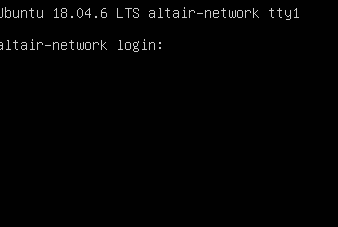

	

	
	
	
	
	
	<h1>🖥 My Vulnerable Machines </h1>

	<h3>Altair-Network Vulnerable Machine</h3>
	
	

 

This repository contains vulnerable machine for my personal portfolio . Below you'll find information about the machine. You can also download [Altair-Network](https://dragonforce.io/threads/boot2root-ctf-for-beginners-altair-network-walkthrough.13729/) here.

| Difficulty | Platform | Size |
|--|--|--|
| Easy | Virtual Box | 4.17 GB |

This machine also :
 -    DHCP Support & IP Auto assign
 -    Use NAT Network

# Writeup
You can also read Altair-Network writeup below:

[Altair-Network Write up](https://dragonforce.io/threads/boot2root-ctf-for-beginners-altair-network-walkthrough.13729/)
